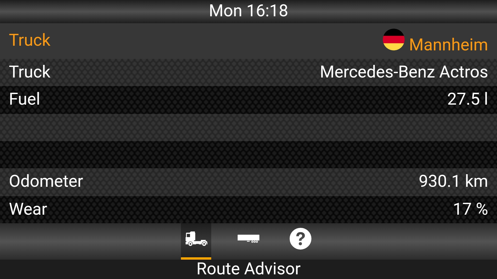
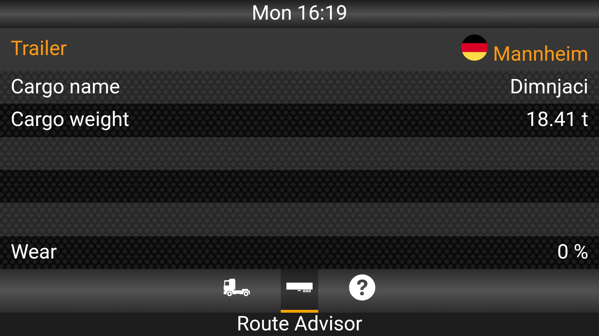
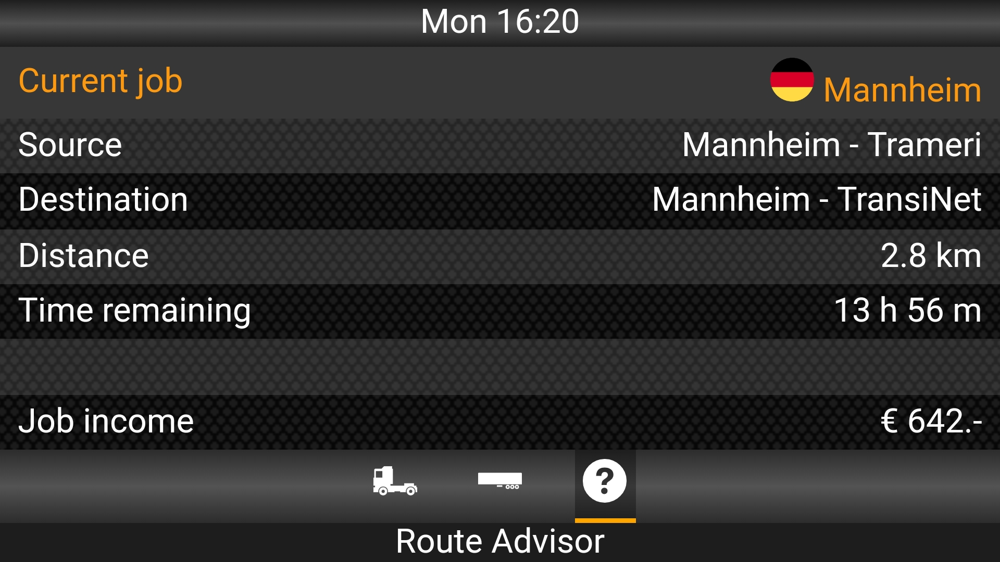
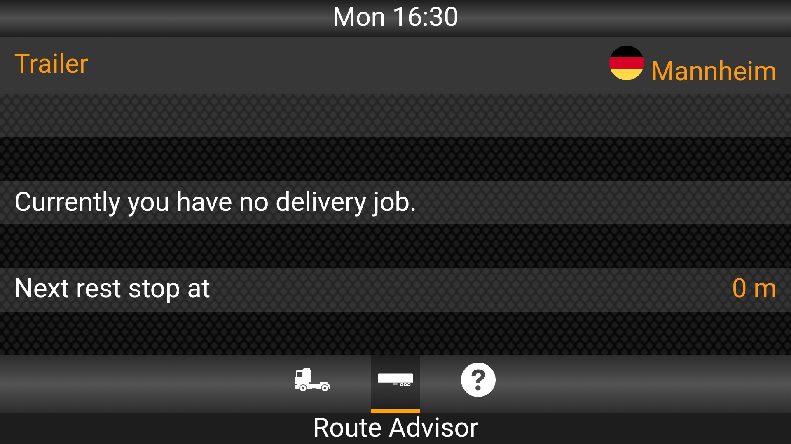
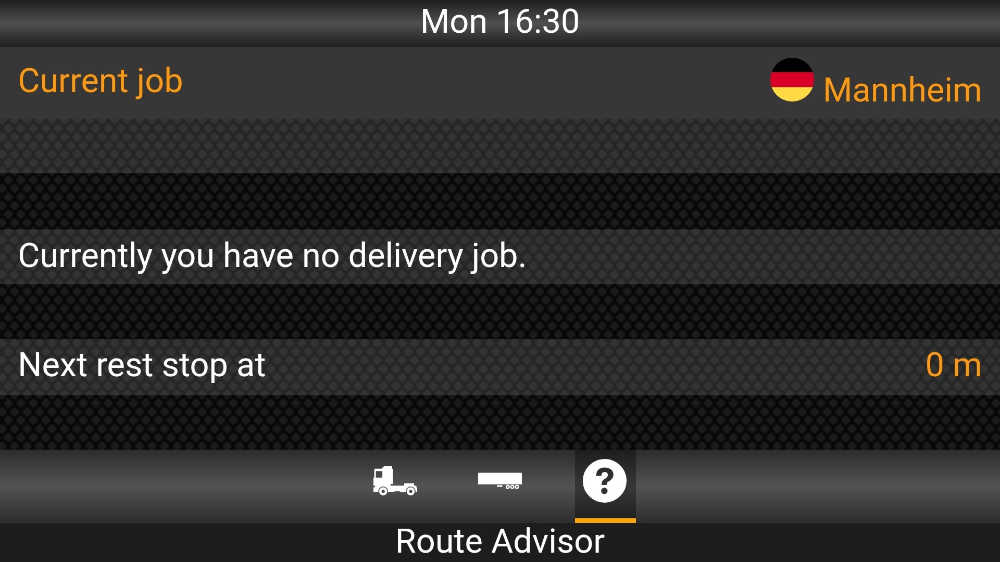
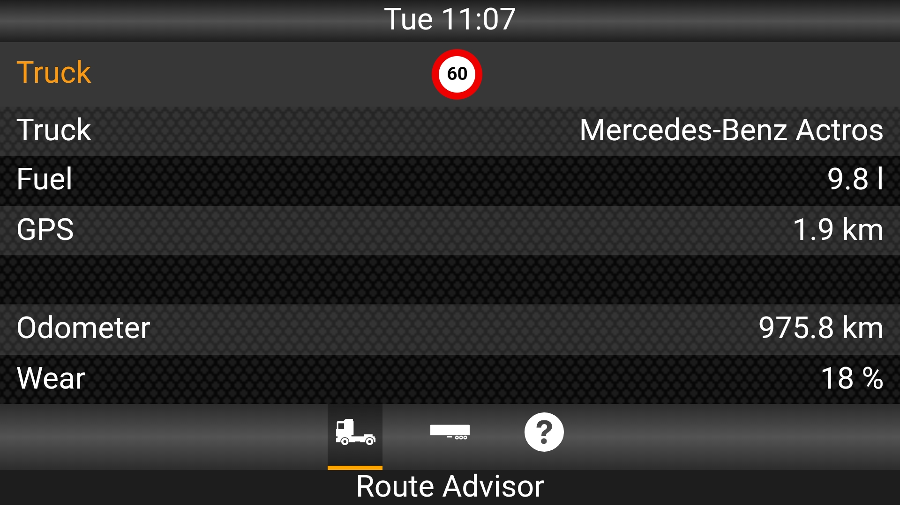
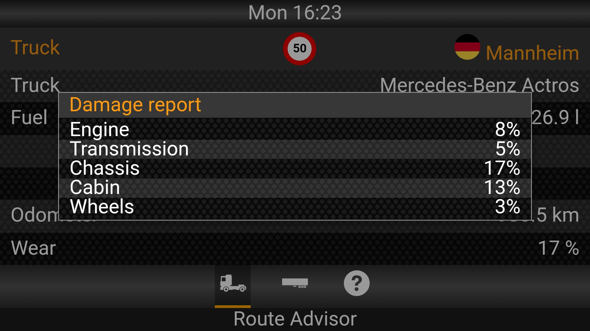
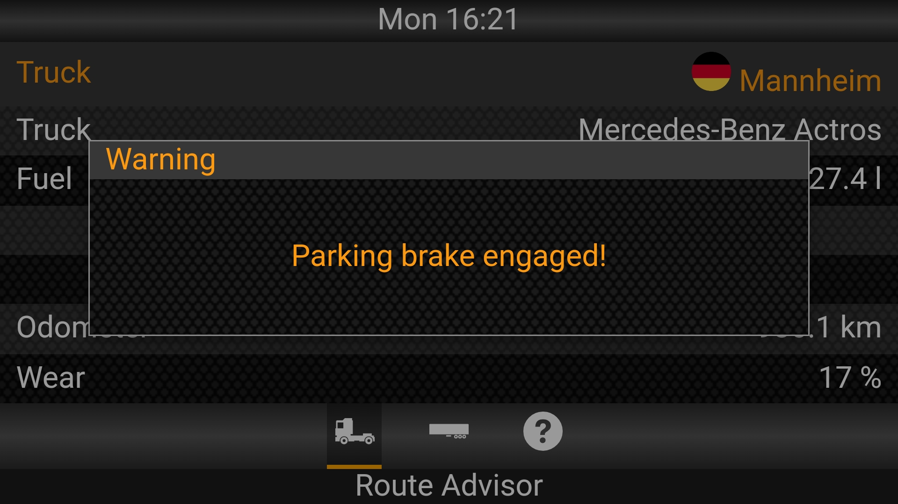
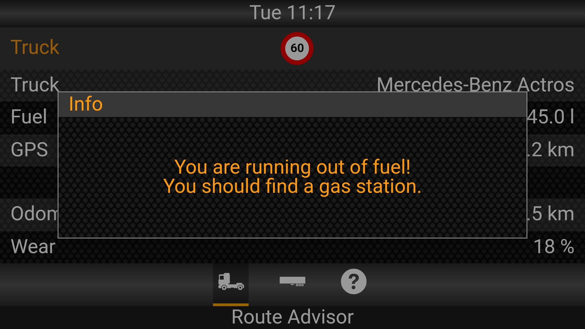
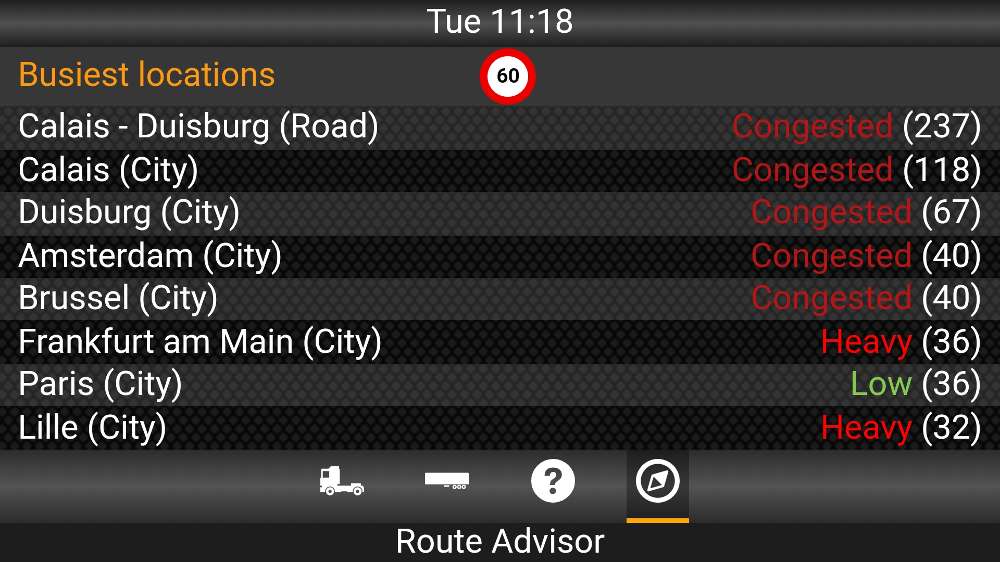

# Route Advisor
Euro Truck Simulator 2 / American Truck Simulator's Route Advisor, for mobile devices. This is a skin for [ETS2 Telemetry Server](https://github.com/mike-koch/ets2-telemetry-server/releases/tag/4.0.0).

## Features
The Route Advisor includes some features that Euro Truck Simulator 2 / American Truck Simulator's Route Advisor currently has. It's slightly edited to display useful informations. These features are:

- Truck information
    - Truck model
    - Fuel
    - GPS *
    - Odometer
    - Truck wear **
- Trailer informarion
    - Cargo name
    - Cargo mass
    - Trailer wear ** 
    - Next rest stop time (no job)
- Current job information
    - Source city and company
    - Destination city and company
    - Distance to destination
    - Time remaining
    - Payout
    - Next rest stop time (no job)
- Busiest locations (TrucksMP) ***
- Short messages tab (Fine and tollgate events) 
- Current day and time
- Nearest city
- Speed limit
- Warning and info pop-up messages (parking brake engaged, low fuel...)

( * ) GPS will show the distance to the marked location.

( ** ) If pressed, a detailed view of the truck/trailer damage will be shown (engine, transmission, cabin (for truck), chassis and wheels (for both)).

( *** ) Only shows if the `isMultiplayer` parameter is set to `true`.

## Requirements
- Euro Truck Simulator 2 and/or American Truck Simulator
- [ETS2 Telemetry Server](https://github.com/mike-koch/ets2-telemetry-server/releases/tag/4.0.0) 4.0.0.

## How to Install
1. Download the latest version of the Route Advisor from the [releases page](https://www.github.com/Klaax/RouteAdvisor/releases).
2. Extract the contents of the zip to the ETS2 Telemetry Server's `/server/Html/skins` directory. You should then have a folder named `RouteAdvisor` in the `skins` directory.

## Languages
A list of supported languages are available on the wiki page. If you would like to submit a translation, please submit a pull request.

## Version history
- 2.0
   - Updated to [ETS2 Telemetry Server](https://github.com/mike-koch/ets2-telemetry-server/releases/tag/4.0.0) 4.0.0.
   - Busiest locations tab now have option to change server (just click on tab name)
   - Added short messages tab (currently display only fines)
   - Some design improvements and bug fixes

- 1.0
   - initial version of Route Advisor

## Screenshots

